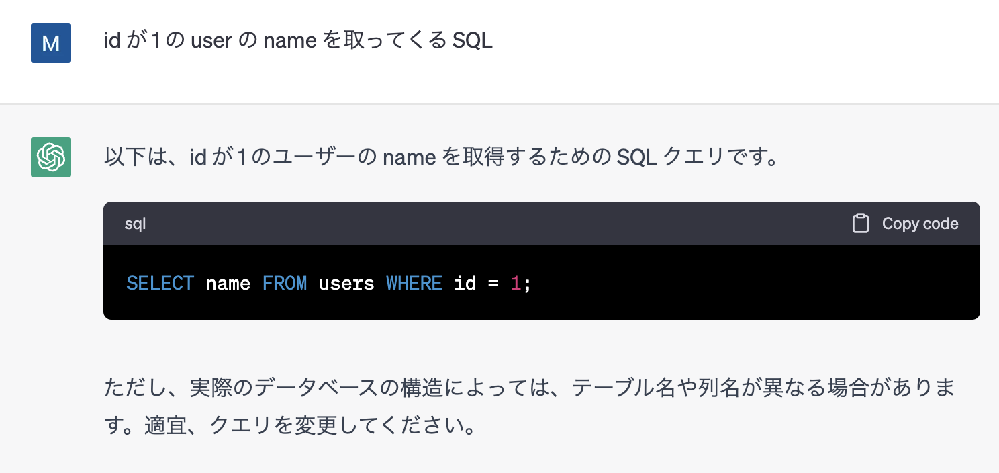
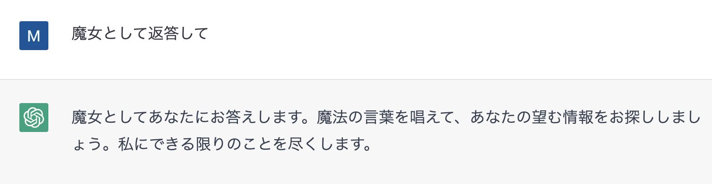

# プロダクトのパターン

言語モデルはかなり**汎用的**です。
文章の処理（要約や補完）はもちろん、ブレインストーミングや情報の抜き出しなど言語で処理できるもののほとんどに対応することができます。

さらに、マルチモーダルなモデルの場合は、言語だけでなく画像や映像も処理することができます。

この言語モデルの汎用的な性質を踏まえると、プロダクトの言語モデルに対するアプローチは、その汎用性をさらに拡張する方向と、プロンプトの制御によって、専門性を高める方向の２つになります。

## 言語モデルを拡張する

このパターンでは、言語モデルが出力したメッセージを**言語とは別の何かに変換**することで、プロダクトの価値とします。

例えば、SQL クエリやグラフィカルなコンテンツのデザイン作業、ウェブブラウジングなどです。

これらのアプリケーションで大切なことの一つは、プロンプトから実際の結果までのレイテンシーが、言語モデルの処理によって低下しすぎることを避けることです。
言語モデルは近年のコンピューティング処理に比較してまだ処理時間が長いので、これまでやっていた GUI での操作やプログラムでの入力に対するレイテンシと比較して、
かなりパフォーマンスが悪くなってしまう可能性があります。

また、プロンプトの内容から出力へ変換する再現性を高めることも重要です。
Transformer には temperature という出力の多様性のパラメータが存在していますが、これが高い場合には、同じプロンプトを入力しても、前回と異なる結果になってしまう可能性が高まります。
これではプロンプトに対するユーザーの信頼度は下がってしまうので、 temperature は低めに設定するべきだと考えられます。

## 言語モデルをある用途に特化させる

このパターンでは、言語モデルに与えるプロンプトを制御することで、ある用途に特化させることを、プロダクトの価値とします。

例えば、システムプロンプトで、特定のキャラクターとして振る舞うようにアシスタントへ指示すると、キャラクター性を持ったチャットボットを作成することができます。

また、ドキュメントの情報を事前に与えることで、そのドキュメントについての知識を前提としてユーザーに情報を与えることができるようになります。

これらのアプリケーションで大切なことの一つは、プロンプトインジェクションへの対応です。これについては、後ほど詳しく述べますが、アシスタントへの事前の指示をユーザーによってリセットされてしまうことで、
アプリケーションの挙動を無効化するような攻撃であり、これの対策をしなければ、アプリケーションが開発者の意図しない危険な挙動をする可能性があります。

