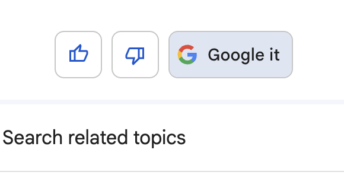

# Fallback

ユーザーの入力パターンを推測することはかなり難しいので、もしアプリケーションで対応できない場合には別のアプリケーションや処理にフォールバックする必要があります。

このフォールバックの例を載せます。

## 別のアプリケーションへの誘導

以下は ChatGPT の例です。ここでは完全に機能を受け渡すのではなく、誘導のためのメッセージにとどめています。

```
Q. 今日の天気を教えて
A. 私はリアルタイムの天気情報を提供することはできませんが、最新の天気予報を確認するためには、天気予報のウェブサイトやアプリをご利用いただくか、検索エンジンで「今日の天気」と検索していただくことをおすすめします。
```

## 既存処理の結果の表示

また Google Bard の例では、アシスタントのメッセージの後に Google 検索結果が表示されます。

これは既存の LLM とは別の処理の結果を合わせて表示することで、アシスタントの役割を補助しています。



既存の処理の結果を表示することは、ユーザーがアシスタントの返答に満足しているかいないかに関わらず表示したほうがいいかは場合によります。

問答無用で既存処理の結果を表示する場合、ユーザーの判定を待っているうちにユーザーは離脱してしまう可能性を排除できますが、ユーザーによってはフォールバックの結果を鬱陶しく感じることもあるでしょう。
