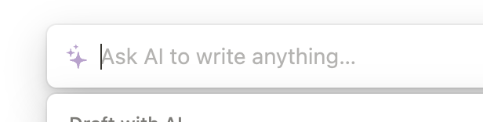

# ビジュアルアイデンティティ

ユーザーとアシスタントとの関係性を構築するためには、アシスタントに**特徴的なビジュアル**を利用する方法を検討してください。

具体的に言うと、例えば、アプリケーションのあらゆる場所にアシスタントとの会話 UX が点在している場合には、
アシスタントが他の UI に埋もれず存在感を保つことができます。
これによりユーザーがアシスタントを利用しようとするタイミングを増やすことができます。

また、**単純接触効果**の観点からもビジュアルアイデンティティの効果を認めることができます。
単純接触効果とは、元々興味がなかった物事や人物に対して、複数回接触を繰り返すことで、興味を持つようになる心理的現象です。
アシスタントにビジュアルがない場合には、ユーザーがアシスタントと接触するタイミングはメッセージをやり取りしている間のみです。
しかし、アシスタントのビジュアルを例えばプロンプト入力欄の隣に配置しておくことで、接触回数をかなり増やすことができます。

必ずしもビジュアルは**具体的である必要はありません**。ビジュアルが抽象的であっても、会話を通してユーザーはアシスタントの存在をリアルに感じることができます。

また、**AI のビジュアルは一般的には、「発光体」が採用されることが多いです。**これらのパターンに合わせることで、ユーザーの学習コストを抑えることができます。

以下にアシスタントのビジュアルの例を載せておきます。

